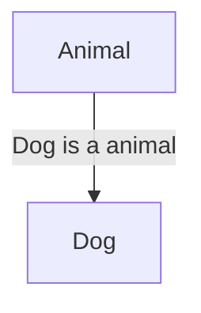

# Deep Dive Object-Oriented Programming, Design Patterns & SOLID Principles

## Summary
- Object-Oriented Programming
    - [Encapsulation](#encapsulation)
    - [Abstraction](#abstraction)
    - [Inheritance](#inheritance)
    - [Composition](#composition)
    - [Polymorphism](#polymorphism)
    - [Coupling](#coupling)
    - [Composition vs inheritance](#compositionVsInheritance)
    - [Fragile base class problem](#fragileBaseClassProblem)
- SOLID
    - ...
- Design patterns
    - ...

# Object-Oriented Programming

<details>
<summary>Encapsulation</summary>
<a name="encapsulation"></a>

Encapsulation is a way to restrict the direct access to some components of an object, so users cannot access state values for all of the variables of a particular object. Encapsulation can be used to hide both data members and data functions or methods (implementation details) associated with an instantiated class or object.  

```python
class Temperature:
    def __init__(self):
        # Private attribute (convention: prefix with underscore)
        self._celsius = 0

    # Public method to set temperature in Celsius
    def set_celsius(self, value):
        if value < -273.15:
            print("Temperature cannot be below absolute zero!")
        else:
            self._celsius = value

    # Public method to get temperature in Celsius
    def get_celsius(self):
        return self._celsius

    # Public method to get temperature in Fahrenheit
    def get_fahrenheit(self):
        return (self._celsius * 9/5) + 32


# Create a Temperature object
temp = Temperature()

# Set temperature in Celsius
temp.set_celsius(25)

# Get temperature in Celsius and Fahrenheit
print(f"Celsius: {temp.get_celsius()}°C")       # Output: Celsius: 25°C
print(f"Fahrenheit: {temp.get_fahrenheit()}°F") # Output: Fahrenheit: 77.0°F

# Try to set an invalid temperature
temp.set_celsius(-300)  # Output: Temperature cannot be below absolute zero!
```

- The `_celsius` attribute is marked as private by prefixing it with an underscore (_). This indicates that it should not be accessed directly from outside the class.  

- The `set_celsius`, `get_celsius`, and `get_fahrenheit` methods provide a controlled interface to interact with the `_celsius` attribute.
</details>

<details>
<summary>Abstraction</summary>
<a name="abstraction"></a>

Abstraction refers to the concept of hiding the complex implementation details and showing only the essential features of an object. In other words, abstraction allows you to focus on what an object does rather than how it does it.
Abstraction is about hiding complexity and showing only the essential features.


- **Abstract Classes:** that cannot be instantiated and may contain abstract methods (methods without implementation).  
- **Interfaces/Protocols:** Define a contract for what methods a class should implement without providing the implementation.

```swift
// Step 1: Define a protocol (abstract interface)
protocol Animal {
    func makeSound()
}

// Step 2: Create concrete classes that conform to the protocol
class Dog: Animal {
    func makeSound() {
        print("Woof!")
    }
}

class Cat: Animal {
    func makeSound() {
        print("Meow!")
    }
}

// Step 3: Use the abstraction
let myDog = Dog()
let myCat = Cat()

myDog.makeSound() // Output: Woof!
myCat.makeSound() // Output: Meow!
```
- The Animal protocol is the abstraction, and Dog and Cat are the concrete implementations.
- The Animal protocol defines a single method makeSound(). This is the abstraction—it tells us what an animal should do (make a sound) but not how it does it.
- Dog and Cat are concrete classes that conform to the Animal protocol. They provide their own implementations of makeSound().

</details>

<details>
<summary>Inheritance</summary>
<a name="inheritance"></a>

Inheritance allows a class (called a child class or subclass) to inherit properties and methods from another class (called a parent class or superclass). This promotes code reusability and establishes a hierarchical relationship between classes.

```Dart
// Parent class
class Animal {
  String name;

  // Constructor
  Animal(this.name);

  // Method
  void makeSound() {
    print("$name makes a sound");
  }
}

// Child class inheriting from Animal
class Dog extends Animal {
  // Constructor
  Dog(String name) : super(name);

  // Overriding the makeSound method
  @override
  void makeSound() {
    print("$name barks!");
  }
}

void main() {
  // Create an object of the Dog class
  Dog myDog = Dog("Buddy");

  // Call methods
  myDog.makeSound(); // Overridden method
}
```



</details>

<details>
<summary>Composition</summary>
<a name="composition"></a>

write explanation here...

</details>

<details>
<summary>Polymorphism</summary>
<a name="polymorphism"></a>

Polymorphism allows objects of different classes to be treated as objects of a common superclass. The term "polymorphism" comes from Greek, meaning "many forms." In OOP, it refers to the ability of a single function, method, or operator to work in different ways depending on the context.

- **Compile-time Polymorphism (Method Overloading):** This is achieved by defining multiple methods with the same name but different parameters.

- **Runtime Polymorphism (Method Overriding):** This is achieved when a subclass provides a specific implementation of a method that is already defined in its superclass.

```Kotlin
// Superclass
open class Shape {
    open fun draw() {
        println("Drawing a shape")
    }
}

// Subclass
class Circle : Shape() {
    override fun draw() {
        println("Drawing a circle")
    }
}

fun main() {
    val shape: Shape = Circle()  // Polymorphism: Shape reference, Circle object
    shape.draw()  // Output: Drawing a circle
}
```
- Superclass (`Shape`): Defines a method `draw()`.
- Subclass (`Circle`): Overrides the `draw()` method to provide its own implementation.
- Polymorphism: The `shape` variable is of type `Shape`, but it holds an object of type `Circle`. When `draw()` is called, the overridden method in `Circle` is executed.

</details>

<details>
<summary>Coupling</summary>
<a name="coupling"></a>

Coupling measures how closely two classes are connected or dependent on each other. High coupling means that classes are tightly interconnected, making the system harder to maintain, modify, and test.

**Benefits of Loose Coupling:**
**Flexibility:** You can easily replace or modify components without affecting other parts of the system.

**Maintainability:** Changes in one class are less likely to break other classes.

**Testability:** It's easier to test classes in isolation when they are not tightly coupled.

**Bad pratice**
Coupling Example:
```ruby
class Car
  def initialize
    @engine = Engine.new
  end

  def start
    @engine.start
  end
end

class Engine
  def start
    puts "Engine started!"
  end
end

car = Car.new
car.start
```

**Good pratice**
**Loose Coupling Example:**
```Ruby
class Car
  def initialize(engine)
    @engine = engine
  end

  def start
    @engine.start
  end
end

class Engine
  def start
    puts "Engine started!"
  end
end

class ElectricEngine
  def start
    puts "Electric engine started!"
  end
end

# Using a regular engine
regular_engine = Engine.new
car = Car.new(regular_engine)
car.start

# Using an electric engine
electric_engine = ElectricEngine.new
car = Car.new(electric_engine)
car.start
```

</details>

<details>
<summary>Composition vs inheritance</summary>
<a name="compositionVsInheritance"></a>

write explanation here...

</details>

<details>
<summary>Fragile base class problem</summary>
<a name="fragileBaseClassProblem"></a>

write explanation here...

</details>

<br/>  

# SOLID