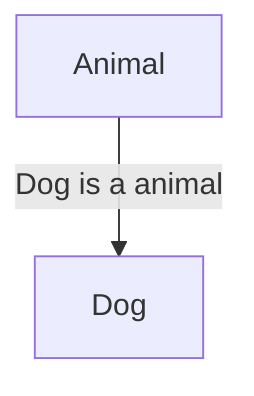

# Deep Dive Object-Oriented Programming, Design Patterns & SOLID Principles

## Summary
- Object-Oriented Programming
    - Encapsulation
    - Abstraction
    - Inheritance
    - Composition
    - Polymorphism
    - Coupling
    - Composition vs inheritance
    - Fragile base class problem
    - Association vs Composition
- SOLID
    - S: Single resposability principle (`SRP`)
    - O: Open-Closed principle (`OCP`)
    - L: Liskov substitution principle (`LSP`)
    - I: Interface segregration principal (`ISP`)
    - D: Dependency Inversion principal (`DIP`)
- Design patterns
    - ...

# Object-Oriented Programming

<details>
<summary>Encapsulation</summary>

Encapsulation is a way to restrict the direct access to some components of an object, so users cannot access state values for all of the variables of a particular object. Encapsulation can be used to hide both data members and data functions or methods (implementation details) associated with an instantiated class or object.  

```python
#python example
class Temperature:
    def __init__(self):
        # Private attribute (convention: prefix with underscore)
        self._celsius = 0

    # Public method to set temperature in Celsius
    def set_celsius(self, value):
        if value < -273.15:
            print("Temperature cannot be below absolute zero!")
        else:
            self._celsius = value

    # Public method to get temperature in Celsius
    def get_celsius(self):
        return self._celsius

    # Public method to get temperature in Fahrenheit
    def get_fahrenheit(self):
        return (self._celsius * 9/5) + 32


# Create a Temperature object
temp = Temperature()

# Set temperature in Celsius
temp.set_celsius(25)

# Get temperature in Celsius and Fahrenheit
print(f"Celsius: {temp.get_celsius()}°C")       # Output: Celsius: 25°C
print(f"Fahrenheit: {temp.get_fahrenheit()}°F") # Output: Fahrenheit: 77.0°F

# Try to set an invalid temperature
temp.set_celsius(-300)  # Output: Temperature cannot be below absolute zero!
```

- The `_celsius` attribute is marked as private by prefixing it with an underscore (_). This indicates that it should not be accessed directly from outside the class.  

- The `set_celsius`, `get_celsius`, and `get_fahrenheit` methods provide a controlled interface to interact with the `_celsius` attribute.
</details>

<details>
<summary>Abstraction</summary>

Abstraction refers to the concept of hiding the complex implementation details and showing only the essential features of an object. In other words, abstraction allows you to focus on what an object does rather than how it does it.
Abstraction is about hiding complexity and showing only the essential features.


- **Abstract Classes:** that cannot be instantiated and may contain abstract methods (methods without implementation).  
- **Interfaces/Protocols:** Define a contract for what methods a class should implement without providing the implementation.

```swift
// swift example
// Step 1: Define a protocol (abstract interface)
protocol Animal {
    func makeSound()
}

// Step 2: Create concrete classes that conform to the protocol
class Dog: Animal {
    func makeSound() {
        print("Woof!")
    }
}

class Cat: Animal {
    func makeSound() {
        print("Meow!")
    }
}

// Step 3: Use the abstraction
let myDog = Dog()
let myCat = Cat()

myDog.makeSound() // Output: Woof!
myCat.makeSound() // Output: Meow!
```
- The Animal protocol is the abstraction, and Dog and Cat are the concrete implementations.
- The Animal protocol defines a single method makeSound(). This is the abstraction—it tells us what an animal should do (make a sound) but not how it does it.
- Dog and Cat are concrete classes that conform to the Animal protocol. They provide their own implementations of makeSound().

</details>

<details>
<summary>Inheritance</summary>

Inheritance allows a class (called a child class or subclass) to inherit properties and methods from another class (called a parent class or superclass). This promotes code reusability and establishes a hierarchical relationship between classes.

```Dart
// Dart example
// Parent class
class Animal {
  String name;

  // Constructor
  Animal(this.name);

  // Method
  void makeSound() {
    print("$name makes a sound");
  }
}

// Child class inheriting from Animal
class Dog extends Animal {
  // Constructor
  Dog(String name) : super(name);

  // Overriding the makeSound method
  @override
  void makeSound() {
    print("$name barks!");
  }
}

void main() {
  // Create an object of the Dog class
  Dog myDog = Dog("Buddy");

  // Call methods
  myDog.makeSound(); // Overridden method
}
```



</details>

<details>
<summary>Composition</summary>

Composition involves creating complex objects by combining simpler objects or components. In composition, objects are assembled together to form larger structures, with each component object maintaining its own state and behavior. Composition is often described in terms of a
"has-a" relationship.

```ruby
# Ruby example

# Define the Car class, which is composed of Engine, Wheels, and Transmission class
class Car
  def initialize
    @engine = Engine.new
    @wheels = Wheels.new
    @transmission = Transmission.new
  end

  def drive
    @engine.start
    @wheels.rotate
    @transmission.shift_gear(1)
    puts "Car is moving!"
  end

  def park
    @transmission.shift_gear(0)
    @engine.stop
    puts "Car is parked."
  end
end

# Create a Car object and use it
my_car = Car.new
my_car.drive
my_car.park
```
- **Reusability:** Components like Engine, Wheels, and Transmission can be reused in other classes (e.g., a Truck class).  
- **Maintainability:** Changes to one component (e.g., Engine) do not affect other components or the Car class.
- **Flexibility:** You can dynamically change the behavior of the Car by swapping out components at runtime.  


</details>

<details>
<summary>Polymorphism</summary>

Polymorphism allows objects of different classes to be treated as objects of a common superclass. The term "polymorphism" comes from Greek, meaning "many forms." In OOP, it refers to the ability of a single function, method, or operator to work in different ways depending on the context.

- **Compile-time Polymorphism (Method Overloading):** This is achieved by defining multiple methods with the same name but different parameters.

- **Runtime Polymorphism (Method Overriding):** This is achieved when a subclass provides a specific implementation of a method that is already defined in its superclass.

```Kotlin
// Kotlin example

// Superclass
open class Shape {
    open fun draw() {
        println("Drawing a shape")
    }
}

// Subclass
class Circle : Shape() {
    override fun draw() {
        println("Drawing a circle")
    }
}

fun main() {
    val shape: Shape = Circle()  // Polymorphism: Shape reference, Circle object
    shape.draw()  // Output: Drawing a circle
}
```
- Superclass (`Shape`): Defines a method `draw()`.
- Subclass (`Circle`): Overrides the `draw()` method to provide its own implementation.
- Polymorphism: The `shape` variable is of type `Shape`, but it holds an object of type `Circle`. When `draw()` is called, the overridden method in `Circle` is executed.

</details>

<details>
<summary>Coupling</summary>

Coupling measures how closely two classes are connected or dependent on each other. High coupling means that classes are tightly interconnected, making the system harder to maintain, modify, and test.

**Benefits of Loose Coupling:**
**Flexibility:** You can easily replace or modify components without affecting other parts of the system.

**Maintainability:** Changes in one class are less likely to break other classes.

**Testability:** It's easier to test classes in isolation when they are not tightly coupled.

**Bad pratice**
Coupling Example:
```ruby
# Ruby example

class Car
  def initialize
    @engine = Engine.new
  end

  def start
    @engine.start
  end
end

class Engine
  def start
    puts "Engine started!"
  end
end

car = Car.new
car.start
```

**Good pratice**
**Loose Coupling Example:**
```Ruby
# Ruby example

class Car
  def initialize(engine)
    @engine = engine
  end

  def start
    @engine.start
  end
end

class Engine
  def start
    puts "Engine started!"
  end
end

class ElectricEngine
  def start
    puts "Electric engine started!"
  end
end

# Using a regular engine
regular_engine = Engine.new
car = Car.new(regular_engine)
car.start

# Using an electric engine
electric_engine = ElectricEngine.new
car = Car.new(electric_engine)
car.start
```

</details>

<details>
<summary>Composition vs inheritance</summary>

**When to Use Composition:**
- When you need more flexibility in constructing objects by assembling smaller, reusable components.
- When there is no clear "is-a" relationship between classes, and a "has-a" relationship is more appropriate.
- When you want to avoid the limitations of inheritance, such as tight coupling and the fragile base class problem - which we will look into shortly.
**When to Use Inheritance:**
- When there is a clear "is-a" relationship between classes, and subclass objects can be treated as instances of their superclass.
- When you want to promote code reuse by inheriting properties and behaviors from existing classes.
- When you want to leverage polymorphism to allow objects of different subclasses to be treated uniformly through their common superclass interface.

</details>

<details>
<summary>Fragile base class problem</summary>

**Fragile Base Class Problem and why you should use composition over inheritance**
- The Fragile Base Class Problem is a software design issue that arises in object-oriented programming when changes made to a base class can inadvertently break the functionality of derived classes. This problem occurs due to the tight coupling between base and derived classes in inheritance hierarchies.
    - **Inheritance Coupling:** Inheritance creates a strong coupling between the base class (superclass) and derived classes (subclasses). Any changes made to the base class can potentially affect the behavior of all derived classes.
    - **Limited Extensibility:** The Fragile Base Class Problem limits the extensibility of software systems, as modifications to the base class can become increasingly risky and costly over time. Developers may avoid making necessary changes due to the fear of breaking existing functionality - Brittle software.

**Mitigation Strategies:** To mitigate the Fragile Base Class Problem, software developers can use design principles such as the Open/Closed Principle (OCP) and Dependency Inversion Principle (DIP), as well as design patterns like Composition over Inheritance. These approaches promote loose coupling, encapsulation, and modular design, reducing the impact of changes in base classes.

</details>

<details>
<summary>Association vs Composition</summary>

**The difference between Association relationship and Composition relationship:**
- **Association:** A Person has a Car, but is not composed of Car. A person holds a reference to Car so it can interact with it, but a Person can exist without a Car.
- **Composition:** When a child object wouldn't be able to exist without its parent object, e.g. a hotel is composed of its rooms, and HotelBathroom cannot exist without Hotel (destroy the hotel, you destroy the hotel bathroom - it can't exist by itself). Also, if a Customer is destroyed, their ShoppingCart and Orders are lost too - therefore Customer is composed of ShoppingCart and Orders. And if Orders are lost, OrderDetails and Shippinginfo are lost - so Orders are composed of Shippinginfo and OrderDetails.

</details>

<br/>  

# SOLID

<details>
<summary>S: Single Resposability Principle SRP</summary>

- A class should have only one reason to change, meaning it should have only one job or responsibility.
- This principle helps to keep classes focused and manageable.

**Problem: Violation of SRP**
The `User` class has two responsibilities:

- Managing user data.
- Saving the user to a database.
- Sending an email.

**Solution: Applying SRP**
We can refactor the code to separate the responsibilities into different classes or modules:

```javascript
// JavaScript example

class User {
  constructor(name, email) {
    this.name = name;
    this.email = email;
  }
}

class UserRepository {
  save(user) {
    // Logic to save user to a database
    console.log(`Saving user ${user.name} to the database...`);
  }
}

class EmailService {
  sendEmail(user) {
    // Logic to send an email to the user
    console.log(`Sending email to ${user.email}...`);
  }
}

// Usage
const user = new User("John", "john@example.com");
const userRepository = new UserRepository();
const emailService = new EmailService();

userRepository.save(user);
emailService.sendEmail(user);
```

</details>

<details>
<summary>O: Open-Closed Principle OCP</summary>

- Software entities (classes, modules, functions, etc.) should be open for extension but closed for modification.

- This means you should be able to add new functionality without altering existing code, promoting the use of abstractions and interfaces.

**Problem: Violation of OCP**

```csharp
// C# example
public class ReportGenerator
{
    public void GenerateReport(string reportType)
    {
        if (reportType == "PDF")
        {
            Console.WriteLine("Generating PDF Report...");
        }
        else if (reportType == "Excel")
        {
            Console.WriteLine("Generating Excel Report...");
        }
        // If we need to add a new report type (e.g., "Word"), we have to modify this class.
    }
}
```
In this example, the `ReportGenerator` `class` violates OCP because if we want to add a new report type (e.g., "Word"), we have to modify the `GenerateReport` `method`. This makes the code harder to maintain and less flexible.

**Solution: Applying OCP**
```csharp
// C# example

// Define an interface for all report generators
public interface IReportGenerator
{
    void GenerateReport();
}

// PDF Report Generator
public class PdfReportGenerator : IReportGenerator
{
    public void GenerateReport()
    {
        Console.WriteLine("Generating PDF Report...");
    }
}

// Excel Report Generator
public class ExcelReportGenerator : IReportGenerator
{
    public void GenerateReport()
    {
        Console.WriteLine("Generating Excel Report...");
    }
}

// Word Report Generator (added later without modifying existing code)
public class WordReportGenerator : IReportGenerator
{
    public void GenerateReport()
    {
        Console.WriteLine("Generating Word Report...");
    }
}

// Report Generator class that works with any IReportGenerator
public class ReportGenerator
{
    public void GenerateReport(IReportGenerator reportGenerator)
    {
        reportGenerator.GenerateReport();
    }
}

// Usage
class Program
{
    static void Main(string[] args)
    {
        var pdfReport = new PdfReportGenerator();
        var excelReport = new ExcelReportGenerator();
        var wordReport = new WordReportGenerator(); // New report type added without modifying existing code

        var reportGenerator = new ReportGenerator();

        reportGenerator.GenerateReport(pdfReport);  // Output: Generating PDF Report...
        reportGenerator.GenerateReport(excelReport); // Output: Generating Excel Report...
        reportGenerator.GenerateReport(wordReport);  // Output: Generating Word Report...
    }
}
```

- `IReportGenerator` Interface: Defines a contract for all report generators, requiring them to implement a `GenerateReport` `method`.

- `PdfReportGenerator` and `ExcelReportGenerator` Classes: Implement the `IReportGenerator` interface and provide their own logic for generating reports.

- `WordReportGenerator` Class: Added later without modifying the existing `ReportGenerator` class.

- `ReportGenerator` Class: Works with any report generator that implements the `IReportGenerator` interface. It doesn’t need to be modified when new report types are added.

</details>

<details>
<summary>Liskov Substitution Principle LSP</summary>

- Objects of a superclass should be replaceable with objects of a subclass without affecting the correctness of the program.

- This principle ensures that a subclass can stand in for its superclass without causing unexpected behavior.

**Problem: Violation of LSP**
example:

- The `Bird` class has a fly method, assuming all birds can fly.

- The `Ostrich` class extends `Bird` but overrides the fly method to `throw` an exception because ostriches cannot fly.

- This violates LSP because an `Ostrich` object cannot be substituted for a `Bird` object without breaking the program (it `throws` an exception).

**Solution: Applying LSP**

- To adhere to LSP, we need to ensure that subclasses can be used in place of their superclass without causing unexpected behavior. One way to fix this is by restructuring the class hierarchy to reflect the correct behavior.

```java
// Java example

// Base class for all birds
class Bird {
    // Common bird behavior
}

// Interface for birds that can fly
interface Flyable {
    void fly();
}

// Sparrow is a bird that can fly
class Sparrow extends Bird implements Flyable {
    @Override
    public void fly() {
        System.out.println("Sparrow is flying...");
    }
}

// Ostrich is a bird that cannot fly
class Ostrich extends Bird {
    // Ostrich-specific behavior
    public void run() {
        System.out.println("Ostrich is running...");
    }
}

public class Main {
    public static void main(String[] args) {
        Flyable sparrow = new Sparrow();
        sparrow.fly(); // Output: Sparrow is flying...

        Ostrich ostrich = new Ostrich();
        ostrich.run(); // Output: Ostrich is running...

        // Now, Ostrich is not forced to implement fly(), and the program works as expected.
    }
}
```

- `Bird` Class: Acts as a base class for all birds, containing common behavior.

- `Flyable` Interface: Defines the `fly` method for birds that can fly.

- `Sparrow` Class: Extends Bird and implements `Flyable` because sparrows can fly.

- `Ostrich` Class: Extends Bird but does not implement `Flyable` because ostriches cannot fly. Instead, it has its own behavior (`run`).

</details>

<details>
<summary>I: Interface Segregration Principal ISP</summary>

- Clients should not be forced to depend on interfaces they do not use.
- This principle encourages the creation of smaller, more specific interfaces rather than large, general-purpose ones.

**Problem: Violation of ISP**

- The `Worker` interface has two methods: `work` and `eat`.

- The `HumanWorker` class implements both methods because humans can work and eat.

- The `RobotWorker` class is forced to implement the `eat` method, even though robots don’t eat. This violates ISP because the `RobotWorker` depends on an interface method it doesn’t use.

**Solution: Applying ISP**

- To adhere to ISP, we can split the Worker interface into smaller, more specific interfaces. This way, classes only implement the methods they need.

- `Workable` Interface: Defines the `work` method for workers who can work.
- `Eatable` Interface: Defines the `eat` method for workers who can eat.
- `HumanWorker` Class: Implements both `Workable` and `Eatable` because humans can work and eat.
- `RobotWorker` Class: Implements only `Workable` because robots don’t eat.
</details>

<details>
<summary>D: Dependency Inversion Principal DIP</summary>

- High-level modules should not depend on low-level modules. Both should depend on abstractions.
- Abstractions should not depend on details. Details should depend on abstractions.
- This principle promotes the decoupling of software modules, making the system more modular and easier to maintain.

```cpp
// C++ example

#include <iostream>
using namespace std;

// Abstraction (interface)
class Switchable {
public:
    virtual void turnOn() = 0;
    virtual void turnOff() = 0;
    virtual ~Switchable() = default; // Virtual destructor for proper cleanup
};

// Low-level module
class LightBulb : public Switchable {
public:
    void turnOn() override {
        cout << "LightBulb: Turned ON" << endl;
    }

    void turnOff() override {
        cout << "LightBulb: Turned OFF" << endl;
    }
};

// Another low-level module
class Fan : public Switchable {
public:
    void turnOn() override {
        cout << "Fan: Turned ON" << endl;
    }

    void turnOff() override {
        cout << "Fan: Turned OFF" << endl;
    }
};

// High-level module
class Switch {
private:
    Switchable& device; // Depends on abstraction, not a concrete implementation
public:
    Switch(Switchable& device) : device(device) {}

    void operate(bool on) {
        if (on) {
            device.turnOn();
        } else {
            device.turnOff();
        }
    }
};

// Usage
int main() {
    LightBulb bulb;
    Fan fan;

    Switch lightSwitch(bulb);
    lightSwitch.operate(true);  // Output: LightBulb: Turned ON
    lightSwitch.operate(false); // Output: LightBulb: Turned OFF

    Switch fanSwitch(fan);
    fanSwitch.operate(true);  // Output: Fan: Turned ON
    fanSwitch.operate(false); // Output: Fan: Turned OFF

    return 0;
}
```

- `Switchable` Interface: Acts as an abstraction that both high-level and low-level modules depend on.

- `LightBulb` and `Fan` Classes: Implement the Switchable interface, providing their own implementations of `turnOn` and `turnOff`.

- `Switch` Class: Depends on the `Switchable` interface instead of a concrete implementation. This makes it flexible and reusable for any device that implements `Switchable`.

</details>

<br/>  

# Design Patterns
